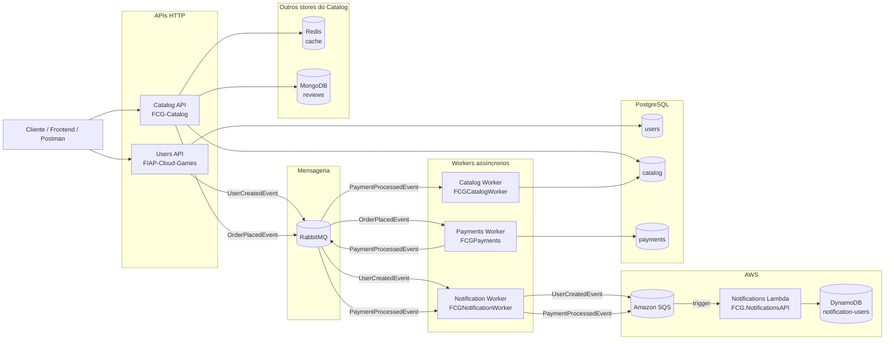
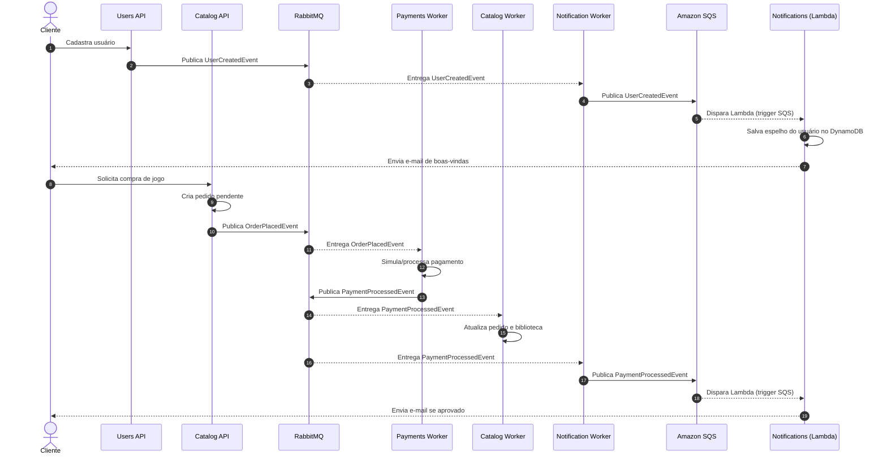
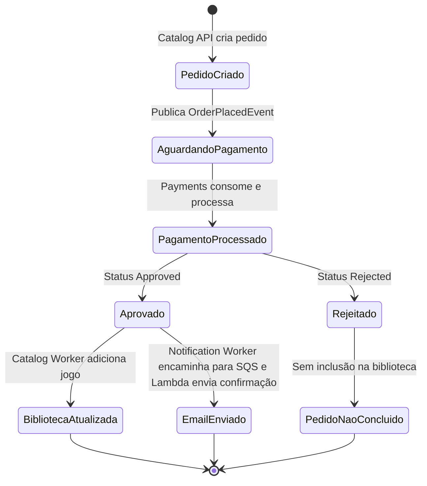
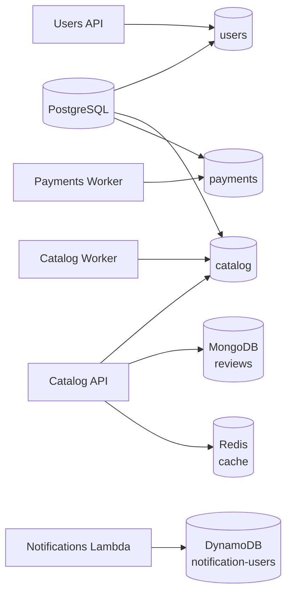

# FIAP Cloud Games - Arquitetura de Microsserviços

Projeto desenvolvido para o Tech Challenge da pós-graduação FIAP, com a evolução de uma aplicação monolítica para uma arquitetura baseada em microsserviços, bancos isolados por contexto e comunicação assíncrona por eventos.

A plataforma simula uma loja de jogos digitais. Usuários se cadastram e autenticam, consultam o catálogo, solicitam compras, têm o pagamento processado de forma assíncrona e recebem notificações transacionais.

## Repositórios da solução

| Repositório | Responsabilidade | Documentação |
| --- | --- | --- |
| **FIAP-Cloud-Games / Users API** | Serviço de usuários, autenticação, autorização, emissão de JWT e publicação de eventos de cadastro. | [README](https://github.com/IgorAnthonyy/FIAP-Cloud-Games/blob/production/README.md) |
| **FCG-Catalog** | API HTTP do catálogo. Gerencia jogos, categorias, pedidos, biblioteca do usuário e reviews, publica o evento de pedido criado, usa MongoDB para reviews e Redis para cache. | [README](https://github.com/SergioHMagalhaes/FCG-Catalog/blob/main/README.md) |
| **FCGPayments** | Worker de pagamentos. Consome pedidos criados, simula o processamento do pagamento e publica o resultado. | [README](https://github.com/pedrobarros01/FCGPayments/blob/main/README.md) |
| **FCGCatalogWorker** | Worker do catálogo. Consome o resultado do pagamento e atualiza pedido/biblioteca do usuário no banco do catálogo. | [README](https://github.com/pedrobarros01/FCGCatalogWorker/blob/main/README.md) |
| **FCG.NotificationsAPI** | Função AWS Lambda de notificações. Triggerada por filas Amazon SQS, persiste no DynamoDB e envia e-mails transacionais via SMTP. | [README](https://github.com/OtavioAndradeCR/FCG.NotificationsAPI/blob/master/README.md) |
| **FCGNotificationWorker** | Worker ponte RabbitMQ → Amazon SQS. Consome as filas de eventos do RabbitMQ e replica cada mensagem para a fila SQS correspondente, disparando a Lambda de notificações. | [README](https://github.com/pedrobarros01/FCGNotificationWorker/blob/master/README.md) |
| **FCG-Shared** | Biblioteca compartilhada com contratos de eventos usados pelos microsserviços. No Users API, entra como submódulo em `src/submodule/FCG.Shared`. | [README](https://github.com/IgorAnthonyy/FCG-Shared/blob/main/README.md) |
| **FCG-Infra** | Infraestrutura e orquestração local com Docker Compose, RabbitMQ, PostgreSQL e manifestos Kubernetes. | [README](https://github.com/IgorAnthonyy/FCG-Infra/blob/production/README.md) |

Links dos repositórios no GitHub:

- [FIAP-Cloud-Games](https://github.com/IgorAnthonyy/FIAP-Cloud-Games)
- [FCG-Catalog](https://github.com/SergioHMagalhaes/FCG-Catalog)
- [FCGPayments](https://github.com/pedrobarros01/FCGPayments)
- [FCGCatalogWorker](https://github.com/pedrobarros01/FCGCatalogWorker)
- [FCG.NotificationsAPI](https://github.com/OtavioAndradeCR/FCG.NotificationsAPI)
- [FCGNotificationWorker](https://github.com/pedrobarros01/FCGNotificationWorker)
- [FCG-Shared](https://github.com/IgorAnthonyy/FCG-Shared)
- [FCG-Infra](https://github.com/IgorAnthonyy/FCG-Infra)

## Visão geral da arquitetura

A solução é composta por APIs síncronas para interação do cliente e workers assíncronos para processamento de etapas internas. A comunicação entre serviços acontece por eventos publicados no RabbitMQ usando MassTransit. Cada contexto possui seu próprio banco lógico: PostgreSQL para os dados relacionais de cada serviço, MongoDB para as reviews do catálogo, Redis como cache distribuído do catálogo e DynamoDB para o espelho de usuários usado pelas notificações.

O serviço de Notificações é uma exceção ao restante da solução: roda como função **AWS Lambda**, que não possui trigger nativo para RabbitMQ (apenas para SQS, Kinesis, DynamoDB Streams, etc.). Por isso, o **FCGNotificationWorker** atua como ponte, consumindo as filas do RabbitMQ e replicando cada mensagem para a fila Amazon SQS correspondente, que então dispara a Lambda, sem exigir que os demais serviços troquem o broker que já utilizam.



## Microsserviços

### Users API

Responsável pelo domínio de usuários. Centraliza cadastro, login, autenticação JWT, perfis de acesso e emissão do evento `UserCreatedEvent` quando um novo usuário é criado. Esse evento é publicado via MassTransit/RabbitMQ usando o contrato do submódulo `src/submodule/FCG.Shared` e alimenta o serviço de notificações, que mantém uma cópia local mínima dos dados necessários para envio de e-mails.

### Catalog API

Responsável pelo domínio de catálogo e compras. Expõe endpoints para categorias, jogos, pedidos, biblioteca do usuário e reviews. Quando o usuário solicita a compra de um jogo, a API cria um pedido pendente no banco `catalog` e publica `OrderPlacedEvent` no RabbitMQ.

Além do PostgreSQL, a Catalog API utiliza dois stores adicionais:

- **MongoDB**: persiste as reviews de jogos (nota, comentário, tags e contagem de votos úteis), em uma collection separada do banco relacional. Usado porque o formato de review é naturalmente um documento (lista de tags variável, sem necessidade de relacionamento forte com outras tabelas).
- **Redis**: cache distribuído para consultas de jogos (`games:*`) e categorias (`categories:*`), seguindo o padrão **Cache-Aside**. Em cache miss, os dados são buscados no PostgreSQL e gravados no Redis com TTL configurável; mutações (criação/atualização/remoção) invalidam as chaves afetadas. Se o Redis estiver indisponível, a API faz fallback transparente para o PostgreSQL, sem interromper as requisições.

### Payments Worker

Responsável por processar pedidos de compra de forma assíncrona. Consome `OrderPlacedEvent`, cria/processa a transação no banco `payments` e publica `PaymentProcessedEvent` com o resultado do pagamento.

### Catalog Worker

Responsável por finalizar o fluxo de compra no contexto do catálogo. Consome `PaymentProcessedEvent`; quando o pagamento é aprovado, atualiza o pedido e adiciona o jogo à biblioteca do usuário no banco `catalog`.

### Notifications (FCG.NotificationsAPI)

Responsável pelo envio de notificações transacionais por e-mail. Roda como função **AWS Lambda**, triggerada por mensagens nas filas **Amazon SQS** (`fcg-user-created` e `fcg-payment-processed`), persiste um espelho mínimo do usuário no **DynamoDB** e envia e-mail via SMTP:

- `UserCreatedEvent`: persiste o usuário no DynamoDB (upsert idempotente via `PutItem` condicional) e envia e-mail de boas-vindas (ou de admin com senha temporária).
- `PaymentProcessedEvent` com status `Approved`: busca o usuário no DynamoDB e envia e-mail de confirmação de compra.

Como o Lambda não possui integração nativa com o RabbitMQ — apenas com fontes como SQS, Kinesis ou DynamoDB Streams —, ele não consome os eventos diretamente do broker usado pelos demais serviços. Essa ponte é feita pelo **FCGNotificationWorker** (ver abaixo).

### Notification Worker (FCGNotificationWorker)

Worker que atua como ponte entre o RabbitMQ e o Amazon SQS, permitindo que o serviço de Notificações rodando no AWS Lambda reaja aos eventos gerados por Users API e Payments Worker sem que os demais serviços precisem alterar o broker que já utilizam.

- Consome as filas `fcg.user-created` (`UserCreatedEvent`) e `payment.processed` (`PaymentProcessedEvent`) no RabbitMQ via MassTransit.
- Para cada mensagem recebida, publica o conteúdo na fila SQS correspondente (`SQS_URL_USER_CREATED` / `SQS_URL_PAYMENT_PROCESSED`), que dispara a Lambda de notificações. O filtro de "só envia e-mail se `Status == Approved`" continua sendo responsabilidade da Lambda, não do worker.
- O ack no RabbitMQ só ocorre depois que o `SendMessageAsync` do SQS retorna com sucesso. Em caso de falha, o MassTransit tenta novamente 3 vezes (intervalo de 5s); se todas falharem, a mensagem vai para uma fila de erro (`<nome-da-fila>_error`), usada como Dead Letter Queue.
- É o único componente do fluxo de notificações que continua rodando como container/worker de longa duração — a Lambda, em contraste, é acionada sob demanda pelo SQS.

### FCG-Shared

Biblioteca compartilhada que concentra contratos de eventos entre os serviços:

- `UserCreatedEvent`
- `OrderPlacedEvent`
- `PaymentProcessedEvent`

No repositório `FIAP-Cloud-Games`, ela é referenciada como submódulo Git em `src/submodule/FCG.Shared`.

### FCG-Infra

Repositório de apoio para subir a solução completa. Contém Docker Compose com PostgreSQL, RabbitMQ e imagens dos serviços, além de manifestos Kubernetes para infraestrutura compartilhada.

## Comunicação entre microsserviços

A comunicação síncrona fica limitada às chamadas do cliente para as APIs HTTP. Entre microsserviços, a integração principal é assíncrona, orientada a eventos.



## Mensageria e eventos

Os serviços utilizam RabbitMQ com MassTransit. Os nomes das filas/chaves podem variar por ambiente, mas a orquestração principal em `FCG-Infra/docker-compose.yml` usa:

| Evento | Publicador | Consumidores | Configuração principal |
| --- | --- | --- | --- |
| `UserCreatedEvent` | Users API | FCGNotificationWorker | Fila `fcg.user-created` |
| `OrderPlacedEvent` | Catalog API | Payments Worker | `RabbitMQ__KeyQueueOrderPlaced=order_placed` |
| `PaymentProcessedEvent` | Payments Worker | Catalog Worker, FCGNotificationWorker | `RabbitMQ__KeyPublisher=payment.processed` e `RabbitMQ__KeyQueuePaymentProcessed=payment.processed` |

O `FCGNotificationWorker` é o único consumidor de `UserCreatedEvent` e `PaymentProcessedEvent` que ainda fala RabbitMQ: ele republica cada evento recebido em uma fila **Amazon SQS** correspondente (`SQS_URL_USER_CREATED` / `SQS_URL_PAYMENT_PROCESSED`), que dispara a função Lambda `FCG.NotificationsAPI`. Esse salto RabbitMQ → SQS existe porque o AWS Lambda não tem trigger nativo para RabbitMQ.

| Fila SQS | Origem (via FCGNotificationWorker) | Consumidor |
| --- | --- | --- |
| `fcg-user-created` | `UserCreatedEvent` | Lambda `FCG.NotificationsAPI` |
| `fcg-payment-processed` | `PaymentProcessedEvent` | Lambda `FCG.NotificationsAPI` |

```mermaid
flowchart TD
    subgraph events[Eventos compartilhados - FCG-Shared]
        userCreated[UserCreatedEvent<br/>UserId, Name, Email, IsAdmin, TemporaryPassword]
        orderPlaced[OrderPlacedEvent<br/>OrderId, UserId, GameId, GameName, Amount, CreatedOn]
        paymentProcessed[PaymentProcessedEvent<br/>OrderId, UserId, GameId, GameTitle, Price, Status]
    end

    users[Users API] --> userCreated
    catalog[Catalog API] --> orderPlaced
    payments[Payments Worker] --> paymentProcessed

    userCreated --> forwarder[FCGNotificationWorker]
    orderPlaced --> payments
    paymentProcessed --> catalogWorker[Catalog Worker]
    paymentProcessed --> forwarder

    forwarder -- SQS: fcg-user-created --> notifications[Notifications Lambda]
    forwarder -- SQS: fcg-payment-processed --> notifications
```



## Fluxo de compra



## Infraestrutura local

Para subir a solução completa, utilize o repositório [FCG-Infra](https://github.com/IgorAnthonyy/FCG-Infra/blob/production/README.md):

```bash
cd ../FCG-Infra
docker compose up -d
```

Serviços principais no Docker Compose:

| Serviço | Porta local | Observação |
| --- | --- | --- |
| Users API | `8081` | API HTTP de usuários |
| Catalog API | `8082` | API HTTP do catálogo |
| RabbitMQ | `5672` | Broker AMQP |
| RabbitMQ Management | `15672` | Interface web do RabbitMQ |
| PostgreSQL | `5432` | Instância compartilhada com bancos separados |
| Payments Worker | Sem porta HTTP | Worker em background |
| Catalog Worker | Sem porta HTTP | Worker em background |
| FCGNotificationWorker | Sem porta HTTP | Worker em background; encaminha RabbitMQ → Amazon SQS |
| MongoDB | `27017` | Banco de documentos usado pelo Catalog API para reviews |
| Redis | `6379` | Cache distribuído usado pelo Catalog API |

O serviço de Notificações (`FCG.NotificationsAPI`) não roda no Docker Compose local: é uma função AWS Lambda, disparada pelas filas Amazon SQS `fcg-user-created` e `fcg-payment-processed`, e persiste os dados no DynamoDB (com opção de `dynamodb-local` para desenvolvimento offline).

No compose individual da Users API (`FIAP-Cloud-Games/docker-compose.yml`), a API sobe em `http://localhost:8080`, com PostgreSQL e RabbitMQ próprios para desenvolvimento isolado desse serviço.

Credenciais padrão do compose principal:

| Recurso | Usuário | Senha |
| --- | --- | --- |
| RabbitMQ | `fcg_user` | `fcg_password` |
| PostgreSQL | `fcg_user` | `fcg_password` |

## Bancos de dados

Embora a infraestrutura local use uma instância PostgreSQL compartilhada, cada microsserviço trabalha com um banco lógico próprio. Além do PostgreSQL, o Catalog API usa MongoDB e Redis como stores adicionais, e o serviço de Notificações usa DynamoDB na AWS:



- **PostgreSQL**: um banco lógico por serviço (`users`, `catalog`, `payments`), acessado via Entity Framework Core.
- **MongoDB** (`fcg_catalog`, collection `reviews`): usado pelo Catalog API para persistir reviews de jogos (nota, comentário, tags, votos úteis), separado do banco relacional.
- **Redis**: cache distribuído do Catalog API para consultas de jogos e categorias, no padrão Cache-Aside, com TTL configurável e fallback para o PostgreSQL em caso de indisponibilidade.
- **DynamoDB** (`fcg-notification-users`): usado pela Lambda de Notificações para manter um espelho mínimo do usuário (`Id`, `Name`, `Email`, `IsAdmin`, `CreatedAt`), necessário para montar os e-mails sem depender de chamadas síncronas a outros serviços. Escritas são idempotentes via `PutItem` condicional (`attribute_not_exists(Id)`).

## Tecnologias

- .NET 10
- ASP.NET Core Web API
- Worker Service
- AWS Lambda
- Entity Framework Core
- PostgreSQL
- MongoDB / MongoDB.Driver
- Redis / StackExchange.Redis
- DynamoDB
- RabbitMQ
- Amazon SQS
- MassTransit
- JWT Bearer
- Docker e Docker Compose
- Kubernetes
- xUnit

## Como navegar pela documentação

1. Comece por este documento para entender a arquitetura geral.
2. Use o [FCG-Infra](https://github.com/IgorAnthonyy/FCG-Infra/blob/production/README.md) para subir o ambiente completo.
3. Consulte o README de cada serviço para detalhes de execução, variáveis de ambiente, testes e deploy individual.
4. Consulte o [FCG-Shared](https://github.com/IgorAnthonyy/FCG-Shared) quando precisar validar contratos de eventos entre os serviços.

## Grupo

- Igor Anthony - igor.anthony.iop@gmail.com
- Nathalia Greice - nponce410@gmail.com
- Otávio de Andrade - otavio_andrade@live.com
- Pedro Henrique Barros - pedrobarros0101@outlook.com
- Sérgio Henrique - ssergioh3@gmail.com
