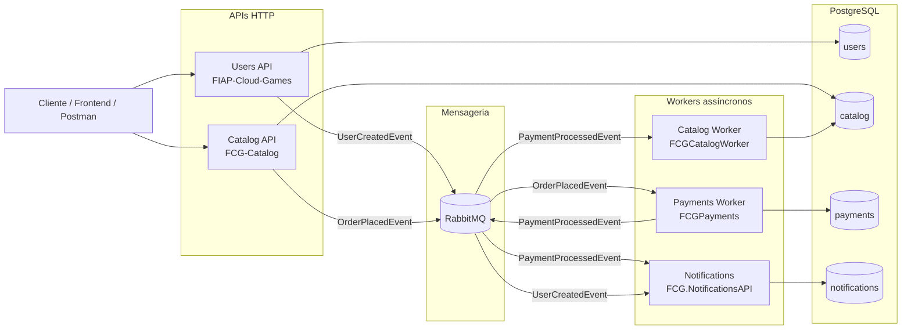
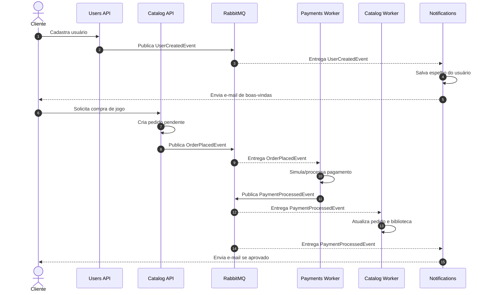
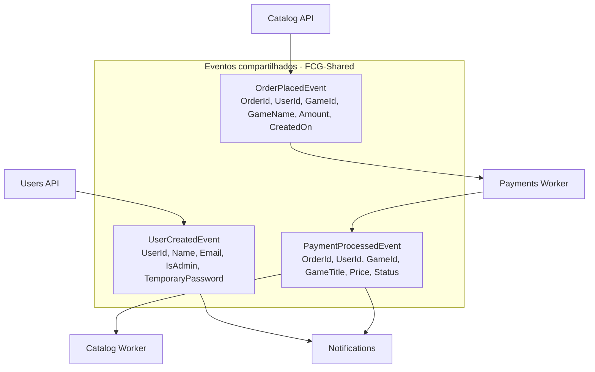
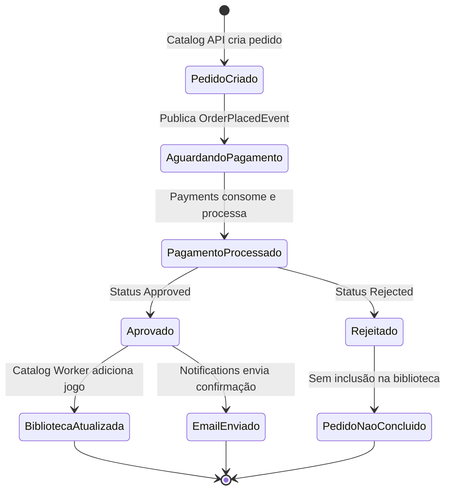
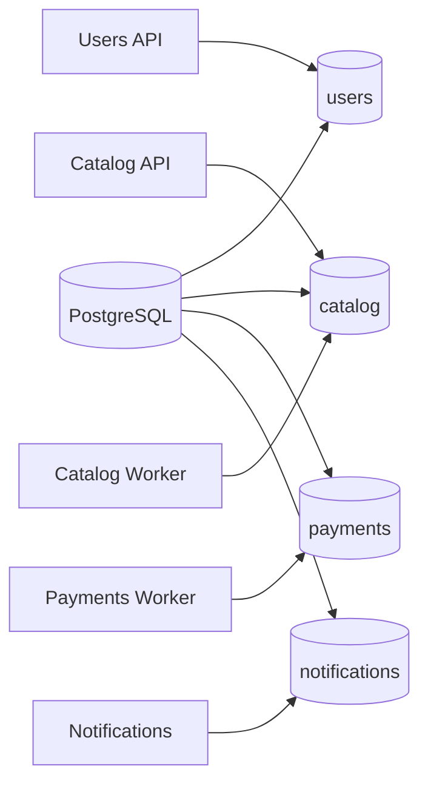

# FIAP Cloud Games - Arquitetura de Microsserviços

Projeto desenvolvido para o Tech Challenge da pós-graduação FIAP, com a evolução de uma aplicação monolítica para uma arquitetura baseada em microsserviços, bancos isolados por contexto e comunicação assíncrona por eventos.

A plataforma simula uma loja de jogos digitais. Usuários se cadastram e autenticam, consultam o catálogo, solicitam compras, têm o pagamento processado de forma assíncrona e recebem notificações transacionais.

## Repositórios da solução

| Repositório | Responsabilidade | Documentação |
| --- | --- | --- |
| **FIAP-Cloud-Games / Users API** | Serviço de usuários, autenticação, autorização, emissão de JWT e publicação de eventos de cadastro. | [README](https://github.com/IgorAnthonyy/FIAP-Cloud-Games/blob/production/README.md) |
| **FCG-Catalog** | API HTTP do catálogo. Gerencia jogos, categorias, pedidos, biblioteca do usuário e publica o evento de pedido criado. | [README](https://github.com/SergioHMagalhaes/FCG-Catalog/blob/main/README.md) |
| **FCGPayments** | Worker de pagamentos. Consome pedidos criados, simula o processamento do pagamento e publica o resultado. | [README](https://github.com/pedrobarros01/FCGPayments/blob/main/README.md) |
| **FCGCatalogWorker** | Worker do catálogo. Consome o resultado do pagamento e atualiza pedido/biblioteca do usuário no banco do catálogo. | [README](https://github.com/pedrobarros01/FCGCatalogWorker/blob/main/README.md) |
| **FCG.NotificationsAPI** | Worker/API de notificações. Consome eventos de usuário criado e pagamento processado para envio de e-mails transacionais. | [README](https://github.com/OtavioAndradeCR/FCG.NotificationsAPI/blob/master/README.md) |
| **FCG-Shared** | Biblioteca compartilhada com contratos de eventos usados pelos microsserviços. No Users API, entra como submódulo em `src/submodule/FCG.Shared`. | [README](https://github.com/IgorAnthonyy/FCG-Shared/blob/main/README.md) |
| **FCG-Infra** | Infraestrutura e orquestração local com Docker Compose, RabbitMQ, PostgreSQL e manifestos Kubernetes. | [README](https://github.com/IgorAnthonyy/FCG-Infra/blob/production/README.md) |

Links dos repositórios no GitHub:

- [FIAP-Cloud-Games](https://github.com/IgorAnthonyy/FIAP-Cloud-Games)
- [FCG-Catalog](https://github.com/SergioHMagalhaes/FCG-Catalog)
- [FCGPayments](https://github.com/pedrobarros01/FCGPayments)
- [FCGCatalogWorker](https://github.com/pedrobarros01/FCGCatalogWorker)
- [FCG.NotificationsAPI](https://github.com/OtavioAndradeCR/FCG.NotificationsAPI)
- [FCG-Shared](https://github.com/IgorAnthonyy/FCG-Shared)
- [FCG-Infra](https://github.com/IgorAnthonyy/FCG-Infra)

## Visão geral da arquitetura

A solução é composta por APIs síncronas para interação do cliente e workers assíncronos para processamento de etapas internas. A comunicação entre serviços acontece por eventos publicados no RabbitMQ usando MassTransit. Cada contexto possui seu próprio banco lógico no PostgreSQL.



## Microsserviços

### Users API

Responsável pelo domínio de usuários. Centraliza cadastro, login, autenticação JWT, perfis de acesso e emissão do evento `UserCreatedEvent` quando um novo usuário é criado. Esse evento é publicado via MassTransit/RabbitMQ usando o contrato do submódulo `src/submodule/FCG.Shared` e alimenta o serviço de notificações, que mantém uma cópia local mínima dos dados necessários para envio de e-mails.

### Catalog API

Responsável pelo domínio de catálogo e compras. Expõe endpoints para categorias, jogos, pedidos e biblioteca do usuário. Quando o usuário solicita a compra de um jogo, a API cria um pedido pendente no banco `catalog` e publica `OrderPlacedEvent` no RabbitMQ.

### Payments Worker

Responsável por processar pedidos de compra de forma assíncrona. Consome `OrderPlacedEvent`, cria/processa a transação no banco `payments` e publica `PaymentProcessedEvent` com o resultado do pagamento.

### Catalog Worker

Responsável por finalizar o fluxo de compra no contexto do catálogo. Consome `PaymentProcessedEvent`; quando o pagamento é aprovado, atualiza o pedido e adiciona o jogo à biblioteca do usuário no banco `catalog`.

### Notifications

Responsável pelo envio de notificações transacionais por e-mail. Consome `UserCreatedEvent` para registrar o usuário localmente e enviar e-mail de boas-vindas. Também consome `PaymentProcessedEvent` para enviar confirmação de compra quando o pagamento é aprovado.

### FCG-Shared

Biblioteca compartilhada que concentra contratos de eventos entre os serviços:

- `UserCreatedEvent`
- `OrderPlacedEvent`
- `PaymentProcessedEvent`

No repositório `FIAP-Cloud-Games`, ela é referenciada como submódulo Git em `src/submodule/FCG.Shared`.

### FCG-Infra

Repositório de apoio para subir a solução completa. Contém Docker Compose com PostgreSQL, RabbitMQ e imagens dos serviços, além de manifestos Kubernetes para infraestrutura compartilhada.

## Comunicação entre microsserviços

A comunicação síncrona fica limitada às chamadas do cliente para as APIs HTTP. Entre microsserviços, a integração principal é assíncrona, orientada a eventos.



## Mensageria e eventos

Os serviços utilizam RabbitMQ com MassTransit. Os nomes das filas/chaves podem variar por ambiente, mas a orquestração principal em `FCG-Infra/docker-compose.yml` usa:

| Evento | Publicador | Consumidores | Configuração principal |
| --- | --- | --- | --- |
| `UserCreatedEvent` | Users API | Notifications | Fila documentada em Notifications: `fcg.user-created` |
| `OrderPlacedEvent` | Catalog API | Payments Worker | `RabbitMQ__KeyQueueOrderPlaced=order_placed` |
| `PaymentProcessedEvent` | Payments Worker | Catalog Worker, Notifications | `RabbitMQ__KeyPublisher=payment.processed` e `RabbitMQ__KeyQueuePaymentProcessed=payment.processed` |



## Fluxo de compra



## Infraestrutura local

Para subir a solução completa, utilize o repositório [FCG-Infra](https://github.com/IgorAnthonyy/FCG-Infra/blob/production/README.md):

```bash
cd ../FCG-Infra
docker compose up -d
```

Serviços principais no Docker Compose:

| Serviço | Porta local | Observação |
| --- | --- | --- |
| Users API | `8081` | API HTTP de usuários |
| Catalog API | `8082` | API HTTP do catálogo |
| RabbitMQ | `5672` | Broker AMQP |
| RabbitMQ Management | `15672` | Interface web do RabbitMQ |
| PostgreSQL | `5432` | Instância compartilhada com bancos separados |
| Payments Worker | Sem porta HTTP | Worker em background |
| Catalog Worker | Sem porta HTTP | Worker em background |
| Notifications | Sem porta HTTP no compose principal | Worker/API em background |

No compose individual da Users API (`FIAP-Cloud-Games/docker-compose.yml`), a API sobe em `http://localhost:8080`, com PostgreSQL e RabbitMQ próprios para desenvolvimento isolado desse serviço.

Credenciais padrão do compose principal:

| Recurso | Usuário | Senha |
| --- | --- | --- |
| RabbitMQ | `fcg_user` | `fcg_password` |
| PostgreSQL | `fcg_user` | `fcg_password` |

## Bancos de dados

Embora a infraestrutura local use uma instância PostgreSQL compartilhada, cada microsserviço trabalha com um banco lógico próprio:



## Tecnologias

- .NET 10
- ASP.NET Core Web API
- Worker Service
- Entity Framework Core
- PostgreSQL
- RabbitMQ
- MassTransit
- JWT Bearer
- Docker e Docker Compose
- Kubernetes
- xUnit

## Como navegar pela documentação

1. Comece por este documento para entender a arquitetura geral.
2. Use o [FCG-Infra](https://github.com/IgorAnthonyy/FCG-Infra/blob/production/README.md) para subir o ambiente completo.
3. Consulte o README de cada serviço para detalhes de execução, variáveis de ambiente, testes e deploy individual.
4. Consulte o [FCG-Shared](https://github.com/IgorAnthonyy/FCG-Shared) quando precisar validar contratos de eventos entre os serviços.

## Grupo

- Igor Anthony - igor.anthony.iop@gmail.com
- Nathalia Greice - nponce410@gmail.com
- Otávio de Andrade - otavio_andrade@live.com
- Pedro Henrique Barros - pedrobarros0101@outlook.com
- Sérgio Henrique - ssergioh3@gmail.com
